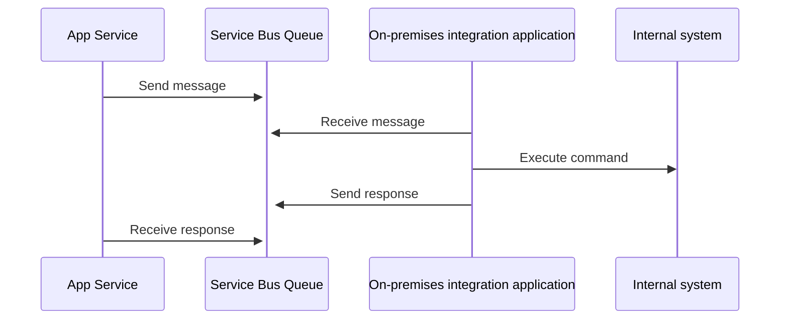

# Azure Integration Services

## Introduction

- [Gartner Glossary: Integration Platform as a Service (iPaaS)](https://www.gartner.com/en/information-technology/glossary/information-platform-as-a-service-ipaas)
- [Azure Integration Services](https://azure.microsoft.com/en-us/products/category/integration/)

## Discussion topics

- Centralized vs. De-centralized
  - Centralized at company level or Business Unit or Service Line level
  - Specialized integration teams vs. cloud developers
- RACI
  - Are some integrations, e.g., most critical ones, outsourced or self-managed? 
- 24x7 or 8x5 categorization
- Business critical vs. Standard integrations
- Cloud, hybrid and on-premises
  - Do you use same integration solution for all integration scenarios?
  - Even if you have existing on-premises infrastructure?
    - Are you going to migrate these over to new solution?
- Functional & Non-functional requirements
- Networking requirements
  - Private endpoint vs. public endpoints
- Security requirements
  - Can you use service specific keys?
  - Do you require use of e.g., managed identities?
  - Data classification
    - Confidential data & exposing them via integrations 
- Batch vs. Near real-time integrations
- Integration catalogue and documentation management
- Development process & agility
- Developer skills: 🔨vs. 🪚
  - E.g., Logic Apps or Data Factory or Functions
- How to choose correct tool for the job?
- How many environments?
- High initial total cost of ownership (TCO) vs. Consumption based pricing
  - Cost of service
  - Cost of build (implementation, deployment, maintenance)
- [Naming conventions](https://docs.microsoft.com/en-us/azure/cloud-adoption-framework/ready/azure-best-practices/resource-abbreviations)
- [Integration architecture design](https://docs.microsoft.com/en-us/azure/architecture/integration/integration-start-here)
- Monitoring
  - Centralized view or solution area views
    - For whom are these views built?
  - Alerts
    - In case of alert, who does and what?
  - [Azure Monitor Community](https://github.com/microsoft/AzureMonitorCommunity)
  - [Azure Workbooks](https://docs.microsoft.com/en-us/azure/azure-monitor/visualize/workbooks-overview)
  - [Azure Monitor Workbook Templates](https://github.com/microsoft/Application-Insights-Workbooks)
- Preparing for Infrastructure-as-Code deployments
  - Enabling quick development of new integrations by having good placeholder templates and CI/CD configurations available
    - E.g., Logic Apps template with example connector and deployment pipeline as starter template or
    placeholder API deployment definition for API Management for quickly adding new API

## Azure structure

- Do you plan to use management groups?
- Have you planned the policy usage?
- Privileged Identity Management (PIM) vs. Standing access?
- How much manual deployments are allowed vs. automated deployments?
- What kind of permissions for developers?
- How do you build your Azure structure?

E.g.,

```bash
├── integrations-nonprod-sub
│   ├── rg-apim
│   └── rg-repair-sales
│       ├── integration1-to-xxx
│       ├── integration2-to-xxx
│       └── integration3-to-xxx
└── integrations-prod-sub
    ├── rg-apim
    └── rg-repair-sales
```

## Technologies

### API Management

- [Azure API Management landing zone accelerator](https://docs.microsoft.com/en-us/azure/cloud-adoption-framework/scenarios/app-platform/api-management/landing-zone-accelerator)
- [Use DevOps and CI/CD to publish APIs](https://docs.microsoft.com/en-us/azure/api-management/devops-api-development-templates)
- [APIOps](https://github.com/Azure/apiops)
  - [APIOps docs](https://azure.github.io/apiops/)
- [Azure API Management DevOps Resource Kit](https://github.com/Azure/azure-api-management-devops-resource-kit)
- [Azure API Management Policy Snippets](https://github.com/Azure/api-management-policy-snippets)
- [API Design](https://github.com/JanneMattila/api-design)
  - API Entity design
- [Azure API Style Guide](https://github.com/Azure/azure-api-style-guide)
- Versioning
  - Do you plan to use versioning?
  - How do you manage version upgrades?
  - Versions and revisions

### Logic Apps

- [Deployments](https://github.com/Azure/logicapps)
  - Infra
  - Workflows
- [Example Workbook](https://github.com/scautomation/LogicApps-AzureMonitor-Workbook)
- Connectors
  - File based integrations and connector limits
  - Private endpoint vs. public endpoints
- Consumption vs. Standard
  - [Cost difference in deployment models](https://azure.microsoft.com/en-us/pricing/details/logic-apps/)
  - Infrastructure as Code is different per deployment model

- How do you group Standard workflows?
- How do you document integrations?
  - Do you use wiki?

### Service Bus

Async messaging example using Service Bus Queue:



#### Additional links

[Azure API Management & Azure Relay - Hybrid Connections & Web Service demo](https://github.com/JanneMattila/325-apim-sb-demo)

[Key Vault(s) to Event Grid to Logic Apps to Azure Pipelines](https://github.com/JanneMattila/key-vault-to-event-grid-to-logic-apps-to-azure-pipelines)

[Azure API Management with Bicep](https://github.com/JanneMattila/azure-api-management-bicep)

[Azure API Management Developer Portal Import and Export scripts](https://github.com/JanneMattila/azure-api-management-developer-portal-import-and-export-scripts)

[Azure API Management Developer Portal Import and Export Actions](https://github.com/JanneMattila/azure-api-management-developer-portal-action)

[Azure API Management with Logic App](https://github.com/JanneMattila/329-azure-api-management-logic-app)

[API Management and self-hosted gateway](https://github.com/JanneMattila/api-management-and-self-hosted-gateway)

[Azure Functions and SFTP](https://github.com/JanneMattila/azure-functions-sftp)

[Azure API Management with Functions](https://github.com/JanneMattila/329-azure-api-management-functions)
