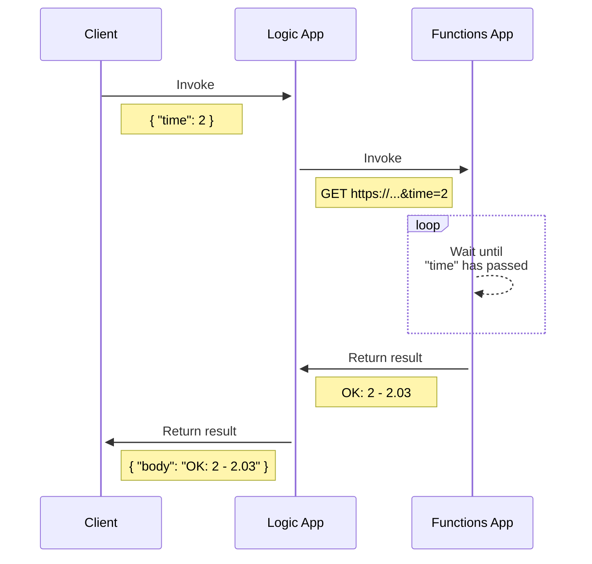
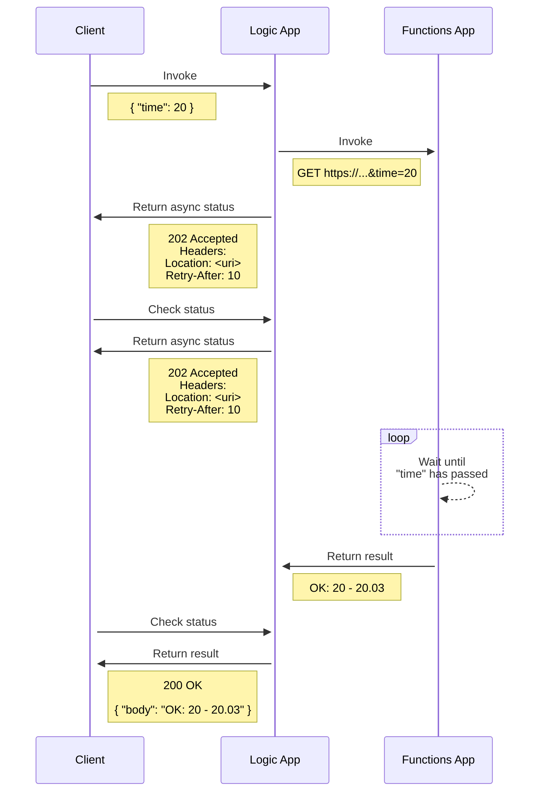
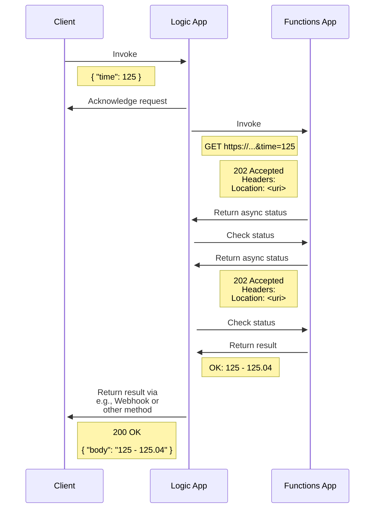

# Logic Apps and Sync or Async HTTP Processing

## Introduction

Understand HTTP Response Action behavior with Consumption (multi-tenant) Logic Apps

## Demo setup

Implementation for our backend Azure Functions App
(similar to [Azure API Management and Azure Functions](apim_and_functions.md)):

```csharp
using System.Threading;
using Microsoft.AspNetCore.Mvc;

public static IActionResult Run(HttpRequest req, ILogger log)
{
  int time = Convert.ToInt32(req.Query["time"]);
  log.LogInformation("Processing request for {Time} seconds.", time);
  var start = DateTime.UtcNow;
  var end = DateTime.UtcNow.AddSeconds(time);
  while (DateTime.UtcNow < end)
  {
    Thread.SpinWait(1_000_000);
  }
  
  var totalSeconds = (DateTime.UtcNow - start).TotalSeconds;
  return new OkObjectResult($"OK: {time} - {totalSeconds}");
}
```

Idea is to be able to mimic `long running process` with our backend.

Testing the Function App:

```bash
> curl "https://funcapp.azurewebsites.net/api/Waiter?code=<key>&time=2"
OK: 2 - 2.0162216
```

## Synchronous processing



Logic App when called with `2`, `20` and `125` parameters:

```bash
> curl "https://prod-25.westcentralus.logic.azure.com:443/workflows/..." --data "{ 'time': 2 }" -H "Content-Type: application/json" | jq
{
  "body": "OK: 2 - 2.0057726"
}

> curl "https://prod-25.westcentralus.logic.azure.com:443/workflows/..." --data "{ 'time': 20 }" -H "Content-Type: application/json" | jq
{
  "body": "OK: 20 - 20.0379424"
}

> curl "https://prod-25.westcentralus.logic.azure.com:443/workflows/..." --data "{ 'time': 125 }" -H "Content-Type: application/json" | jq
{
  "error": {
    "code": "ResponseTimeout",
    "message": "The server did not receive a timely response from the upstream server. Request tracking id '0858544674707'."
  }
}
```

## Asynchronous processing



> Asynchronous response allows a Logic App to respond with a 202 (Accepted) to indicate the request
> has been accepted for processing. A location header will be provided to retrieve the final state. 

Here are example headers:

```bash
Location: https://prod-25.westcentralus.logic.azure.com/workflows/...
Retry-After: 10
```

You can poll that location url to get the current status:

```bash
> curl -s "https://prod-25.westcentralus.logic.azure.com/workflows/..." | jq
{
  "properties": {
    "waitEndTime": "2022-07-05T04:08:18.8194351Z",
    "startTime": "2022-07-05T04:08:18.8194351Z",
    "status": "Running",
    "correlation": {
      "clientTrackingId": "08585446127866592984843882569CU21"
    },
    "workflow": {
      "id": "/workflows/81043f56dc0340f395b1d8a5d40865f2/versions/08585446707563414689",
      "name": "08585446707563414689",
      "type": "Microsoft.Logic/workflows/versions"
    },
    "trigger": {
      "name": "manual",
      "inputsLink": {
        "uri": "https://prod-25.westcentralus.logic.azure.com:443/workflows/...",
        "contentVersion": "rmc+DGEJG6J1YZoaZE2oDQ==",
        "contentSize": 69,
        "contentHash": {
          "algorithm": "md5",
          "value": "rmc+DGEJG6J1YZoaZE2oDQ=="
        }
      },
      "outputsLink": {
        "uri": "https://prod-25.westcentralus.logic.azure.com:443/workflows/...",
        "contentVersion": "GN/lz84DzeB+N9uwxvFaGA==",
        "contentSize": 319,
        "contentHash": {
          "algorithm": "md5",
          "value": "GN/lz84DzeB+N9uwxvFaGA=="
        }
      },
      "startTime": "2022-07-05T04:08:18.8162386Z",
      "endTime": "2022-07-05T04:08:18.8162386Z",
      "originHistoryName": "08585446127866592984843882569CU21",
      "correlation": {
        "clientTrackingId": "08585446127866592984843882569CU21"
      },
      "status": "Succeeded"
    },
    "outputs": {},
    "response": {
      "startTime": "2022-07-05T04:08:18.8162386Z",
      "correlation": {},
      "status": "Waiting"
    }
  },
  "id": "/workflows/81043f56dc0340f395b1d8a5d40865f2/runs/08585446127866592984843882569CU21",
  "name": "08585446127866592984843882569CU21",
  "type": "Microsoft.Logic/workflows/runs"
}
```

Example with `100` as parameter after processing has finished:

```bash
> curl -s "https://prod-25.westcentralus.logic.azure.com/workflows/..." | jq
{
  "body": "OK: 100 - 100.0255121"
}
```

**Note**: In above implementation, HTTP Action still has 
[120 seconds timeout limit](https://docs.microsoft.com/en-us/azure/logic-apps/logic-apps-limits-and-config?tabs=azure-portal#http-request-limits). 
In order to support longer processing times, you'll need to use alternative ways of processing data and way of communicating the end result to the caller.

## Asynchronous processing with separate backchannel for response



You can use below (*very much simplified*) Azure Functions implementation,
if you need to test Logic App HTTP Action Async processing with long running process:

```csharp
using Microsoft.AspNetCore.Mvc;

public static IActionResult Run(HttpRequest req, ILogger log)
{
  var currentRequest = $"https://{Environment.GetEnvironmentVariable("WEBSITE_HOSTNAME")}{req.Path}{req.QueryString}";
  var time = Convert.ToInt32(req.Query["time"]);
  if (req.Query.ContainsKey("end"))
  {
    // Check if async job is finished
    var start = new DateTime(Convert.ToInt64(req.Query["start"]), DateTimeKind.Utc);
    var end = new DateTime(Convert.ToInt64(req.Query["end"]), DateTimeKind.Utc);
    if (end < DateTime.UtcNow)
    {
      var totalSeconds = (DateTime.UtcNow - start).TotalSeconds;
      return new OkObjectResult($"OK: {time} - {totalSeconds}");
    }
    return new AcceptedResult(currentRequest, null);
  }
  else if (req.Query.ContainsKey("time"))
  {
    // Start async job
    return new AcceptedResult($"{currentRequest}&start={DateTime.UtcNow}&end={DateTime.UtcNow.AddSeconds(time).Ticks}", null);
  }
  return new BadRequestResult();
}
```

Combined with communication to client via separate channel
e.g., Webhook, then you can handle long running processes.

## Links

See HTTP Rest example for [more details](la_sync_or_async_http_processing.http).

[Receive and respond to inbound HTTPS requests in Azure Logic Apps](https://docs.microsoft.com/en-us/azure/connectors/connectors-native-reqres)
